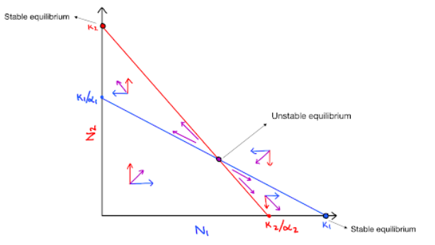
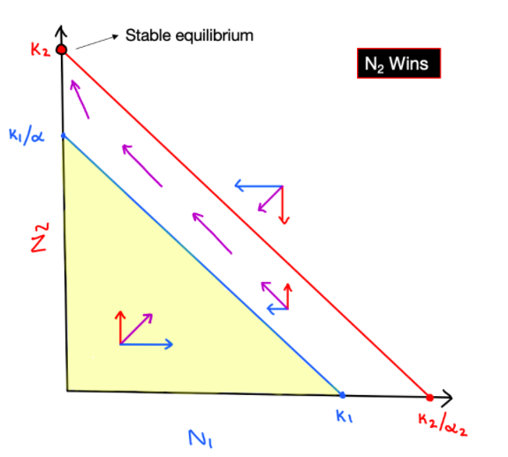
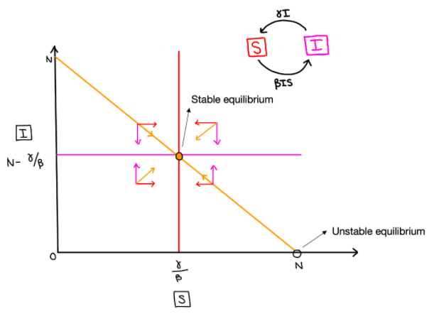
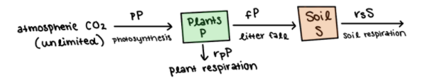
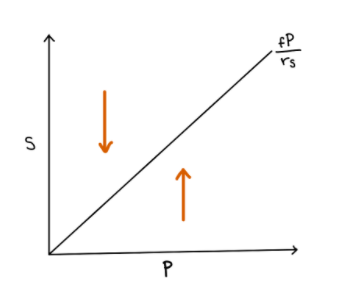

```{r setup, include = FALSE}
knitr::opts_chunk$set(echo = FALSE, message = FALSE)
require(tidyverse)
# Source all functions 
miceadds::source.all(here::here("assignment_1/functions"))
```

# Question 1

In class, we derived three cases for the equilibrium state of the Lotka-Volterra competition model with two species. Using a phase space diagram, draw the fourth and final possible outcome for this model. Your diagram should include labeled axes, the isoclines with their intercepts, as well as arrows demonstrating the directions of the populations and any equilibrium points circled. 

Does this case have a stable equilibrium point? An unstable equilibrium point?

{width=70%}


**Figure 1:** A phase state diagram for the Lotka-Volterra model, where $K_1 > \frac{K_2}{\alpha_2}$ and $K_2 > \frac{K_1}{\alpha_1}$.


## Answer 1
In the Lotka-Volterra model, in the case where $K_1 > \frac{K_2}{\alpha_2}$ and $K_2 > \frac{K_1}{\alpha_1}$, there are two distinct stable equilibria, located at $N_1=K_1$ and $N_2=K_2$, and a third unstable equilibrium point where the nullclines of the two species intersect (Fig. 1). Points residing above the blue $N_1$ nullcline and below the red $N_2$ nullcline will head towards competitive exclusion of species 1 (ie. $N_2$ wins), while those above the red $N_2$ nullcline but below the blue $N_1$ nullcline will move towards competitive exclusion of species 2 (ie. $N_1$ wins), defining this intersection as an unstable equilibrium. The outcome of interaction in this given scenario, is therefore dependent on the original abundances of each species. 

\pagebreak

# Question 2

You are on an environmental preservation team tasked with ensuring diversity in a environment containing two organisms in the same niche. In similar sites, it has been observed that organism 2 quickly dominates and reduces organism 1 to local extinction. One of your colleagues has proposed that intermittently reducing the number of organism 2 individuals, $N_2$, could prevent $N_1$, the number of organism 1 individuals, from crashing. However, your means of reducing $N_2$ is not very precise, and the disturbance will cause both $N_2$ and $N_1$ to decrease by a constant factor $\rho \in (0, 1)$ each time the reduction is applied. That is, at discrete intervals, both $N_1$ and $N_2$ will suddenly be reduced to values $\rho N_1$ and $\rho N_2$.

Do you think your colleague’s suggestion could help preserve healthy levels of both $N_1$ and $N_2$? Support your argument with a sketch using the phase space diagram from question 1. Is there a range of values which $\rho$ must take on for the intervention to be effective? Suppose you can apply the reduction whenever you like (it doesn’t necessarily have to be a fixed schedule).

{width=70%}


**Figure 2:** A phase state diagram for the conditions described in question 2 where the second organism quickly begins to dominate.


## Answer 2

The suggestion of our colleague by which we could intermittently decrease the populations of species $N_2$ to preserve the population of organism 1 and prevent it from becoming extinct, is feasible. The above phase-space diagram demonstrates a Lotka-Volterra outcome in which species 2 ($N_2$) dominates over species 1 in between the two isoclines of each respective species.

Our colleague’s suggestion could work. If we get the populations of $N_1$ and $N_2$ down beneath the blue line, $N_2$ will no longer dominate and both populations will grow (until they reach the blue line again). Therefore, we could reduce both populations by a certain percentage to new levels of $\rho N_1$ and $\rho N_2$, where:
	$$0 < \rho N_1 < K_1$$
	$$0 < \rho N_2 < \frac{K_1}{\alpha_2}$$
Then we can solve for $\rho$, and we get:
	$$0 < \rho < \frac{K_1}{N_1}$$
	$$0 < \rho < \frac{K_1}{N_2~\alpha_2}$$
The relative values of $\frac{K_1}{N_1}$ and $\frac{K_1}{N_2~\alpha_2}$ will depend on the values of the parameters, but $\rho$ must be smaller than the smaller expression and greater than zero.


\pagebreak


# Question 3

Write your own implementations of Euler’s method and Heun’s method (aka 2nd order Runge-Kutta, aka improved Euler’s method) in the language of your choice. Each function should have a tunable parameter $h$ which represents the step size. 

What is the relationship between Euler’s method and a discrete time model? Chapter 6.4 in the textbook contains a helpful discussion.

## Answer 3

We implemented Euler’s method and Heun’s method in R with a tunable parameter h representing the step size. Even though our SIS model is continuous, Euler’s and Heun’s methods each do a discrete approximation, estimating the state of the model at discrete time steps. Beginning with the initial state of the model and the first derivative of each state variable at that time, these two methods estimate the model trajectory and estimate its state at the next time step. They continue to estimate the state of the model at subsequent discrete time steps for as many time steps as we care to calculate. With a very small step size, Euler and Heun give better approximations of continuous time, but with larger step sizes (larger values of h) it becomes clear that these are discrete functions: on a time plot we will see straight line segments connecting values of the state variables at discrete time steps. Since these methods are only approximations, error (the difference between the true value of the state variable and the estimate) will compound over time, and after a long time, Euler and Heun’s method will diverge from each other and from the true state of the system. Basically, Euler’s and Heun’s methods are discrete time models of continuous functions.

\pagebreak

# Question 4

Numerically solve the continuous SIS model from class using both of your integrators and parameters $N = 100$, $\gamma = 0.25$, and each $\beta \in {0.03, 0.06, 0.1}$. Create 9 different plots showing time series from both your Euler’s and Heun’s method with each of these parameter combinations, as well as using step sizes $h \in {0.01, 0.5, 2.0}$. Include legends to distinguish the pairs of $\beta$ and step sizes, and make sure it is clear which line 1 corresponds to which method. Run the model for 50 steps each time, and use initial values of $(S, I) = (90, 10)$.

## Plots

```{r, include = FALSE}
source(here::here("assignment_1/scripts/integrate_sis_model.R"))
```

```{r, fig.height = 3, fig.width = 7}
# Plotting ----
df %>%
  mutate(beta = paste0("beta = ", beta)) %>%
  filter(h == 0.01) %>%
  ggplot() +
  geom_line(aes(x = t, 
                y = Number, 
                color = Box, 
                linetype = method)) +
  scale_color_manual(values = c("firebrick", "darkblue")) +
  ylim(c(0, 100)) +
  xlab("Time") + 
  theme_classic() +
  facet_wrap(~ beta, nrow = 1)
```


**Figure 3:** A comparision of Euler and Heun's Methods for $\beta \in {0.03, 0.06, 0.1}$ for the step size $h = 0.01$, with $\gamma = 0.25$ and initial conditions of $(S, I) = (90, 10)$.

```{r, fig.height = 3, fig.width = 7}
df %>%
  mutate(beta = paste0("beta = ", beta)) %>%
  filter(!is.nan(Number) & Number <= 200 & Number >= -100) %>%
  filter(h == 0.5) %>%
  ggplot() +
  geom_line(aes(x = t, 
                y = Number, 
                color = Box, 
                linetype = method)) +
  scale_color_manual(values = c("firebrick", "darkblue")) +
  ylim(c(-100, 200)) +
  xlab("Time") + 
  theme_classic() +
  facet_wrap(~ beta, nrow = 1)
```


**Figure 4:** A comparision of Euler and Heun's Methods for $\beta \in {0.03, 0.06, 0.1}$ for the step size $h = 0.5$, with $\gamma = 0.25$ and initial conditions of $(S, I) = (90, 10)$.

```{r, fig.height = 3, fig.width = 7}
df %>%
  mutate(beta = paste0("beta = ", beta)) %>%
  filter(!is.nan(Number) & Number <= 200 & Number >= -100) %>%
  filter(h == 2) %>%
  ggplot() +
  geom_line(aes(x = t, 
                y = Number, 
                color = Box, 
                linetype = method)) +
  scale_color_manual(values = c("firebrick", "darkblue")) +
  ylim(c(-100, 200)) +
  xlab("Time") + 
  theme_classic() +
  facet_wrap(~ beta, nrow = 1)
```


**Figure 5:** A comparision of Euler and Heun's Methods for $\beta \in {0.03, 0.06, 0.1}$ for the step size $h = 2.0$, with $\gamma = 0.25$ and initial conditions of $(S, I) = (90, 10)$.

Is there a noticeable difference between the two methods? What might be going on?

## Answer 4
With very low step sizes (_i.e._ h = 0.01) there is hardly a noticible difference between the two methods (Fig 1 A. B. C.) However, as you begin to increase the step size significantly (_i.e._ 50 times larger at h = 0.5), then there begins to be a noticeable difference between the two methods. Because Euler’s method has larger error associated with each step (on the order of h), it accumulates error more quickly than Heun’s method (on the order of $h^2$). 

\pagebreak

# Question 5

Show mathematically that the global precision of Heun’s method is in $h^2$ (where h is the step size). 

## Answer 5

If we expand the approximation of $x(t + h)$ with Heun’s method and compare it to $x(t+h)$ as approximated by Taylor Series we can see that the local error of Heun’s method is ~ $h^3$. From there, we can reason that the global error is ~ $h^2$:

Taylor Series: $x(t + h) = x(t) + h x'(t) + \frac{h^2}{2} x''(t) + \frac{h^3}{3!} x''' + \frac{h^4}{4!} x'''' + …$

Heun’s Method: $x_h(t + h) = x(t) + \frac{h^2}{2} ( x'(t) + x_e'(t+h) ) = x(t) + \frac{h}{2} x'(t) + \frac{h}{2} x_e'(t+h)$

$$
\begin{aligned}
\text{Where:} ~~~~~ x_e(t+h) &= x(t) + hx'(t) ~~~~~~~~ \text{(Euler’s method)} \\
x_e'(t+h) &= x'(t) + hx''(t) \\
\end{aligned}
$$

$$
\begin{aligned}
x_h(t+h) &= x(t) + \frac{h}{2} x'(t) + \frac{h}{2} ( x'(t) + h x''(t) ) \\
	       &= x(t) + \frac{h}{2} x'(t) + \frac{h}{2} x'(t) + \frac{h}{2} hx''(t) \\
	       &= x(t) + h x'(t) + \frac{h^2}{2} x''(t) \\
	       &= \text{the first three terms of Taylor Series}
\end{aligned}
$$

So the local error of Heun's method is mainly governed by the fourth term of the Taylor Series, $\frac{h^3}{3!} x'''$, which is proportional to $h^3$.

To get from local to global error, we add up the errors for each time step from $t = 0$ to $t = T$, so we can multiply the local error by the total number of time steps, calculated as (total time $T$)/(step size $h$). This gives:
Global error = local error summed over all time steps ~ $\frac{T}{h}O(h^3) \sim O(h^2)$.
So the global error for Heun’s method is $\sim h_2$

\pagebreak

# Question 6

The 2-species Lotka-Volterra predator-prey model is very similar to the SIS epidemic model studied in class. Why did we see cycles in the predator-prey model and not the SIS one? What about SIR or SIRS systems? Should we expect chaos in classic epidemic models?


## Answer 6

The 2-species Lotka-Volterra predator prey model has an open population of sharks and fish so it has two degrees of freedom and we can plot its phase space in two dimensions. As we saw in the textbook and in the Week 5 video lectures, we can plot the nullclines in this phase space, use them to visualize the system trajectory with arrows, and thus find the equilibrium point(s). In the textbook’s version of the Lotka-Volterra model (with no density dependence) the nullclines are horizontal and vertical lines, dividing the phase space into 4 regions where the trajectories form a cycling spiral or orbital pattern (@Sayama2015 pp. 117; Figure 7.4).

In contrast, the SIS model has a closed population. People flow back and forth between $S$ and $I$, but $S + I = N$, a fixed population size, so we can represent the system dynamics with just one differential equation, $\frac{dS}{dt}$ (or we could use just $\frac{dI}{dt}$). Then, at any given time, we can calculate $I$ from $N$ and $S$. This means the system only has one degree of freedom. We can plot the phase space in two dimensions, but the actual values of S and I will always fall along a line from $(0, N)$ to $(N, 0)$. We can still find the equilibrium points by setting our differential equations equal to zero and solving. These will show us the trajectories in the phase space, but in reality the trajectories are limited to movement along the line $I = N - S$, so no matter the values of the parameters, we only have two equilibrium points: a stable and an unstable one (Figure 6), and the trajectories are limited to movement along the line towards or away from these equilibrium points, so we cannot have cycles (orbitals) in the SIS model. 

{width=70%}


**Figure 6:** A phase state diagram of the SIS model.

In the SIR model, we cannot have cycles for a different reason. Even though this system has two degrees of freedom, people only move through the system in one direction: from S to I to R. Therefore there is only one possible equilibrium point: everyone moves into the final box, R, so $R^* = N$ and $S^* = I^* = 0$. 

The SIRS model can exhibit cycles depending on the parameter values, like the waves of an epidemic described in @Bj. This model has 3 variables and a closed population, so it has two degrees of freedom. It will have an unstable equilibrium point at $I^* = R^* = 0$ and $S^* = N$, and depending on the values of the parameters, it could have another, stable equilibrium point, or it could exhibit waves (spirals in the phase plane) settling down to a stable point, or steady cycles (orbitals in the phase plane), like the seven year cycle seen for syphilis. 

We would not expect to see chaos in SIS or SIR models for the same reasons we would not see cycles in those models. It may be possible to see chaos in SIRS models, depending on the initial conditions and the values of the parameters. 

\pagebreak

# Question 7

Using any system of your choice, come up with your own ODEs to model some phenomena in the system (for example, growth of a population, or spread of a rumor or contagion). The phenomena could be hypothetical, or based on real-world observations that you have studied or read about. Write down what the state variables of your model are, the parameters, and some interesting assumptions you made to simplify the model compared to the real world. Provide several figures of time-series plots with various combinations of parameters and initial conditions. Do you think your model can have cycles and/or stable/unstable equilibria? What do you think your model can tell you about its real-world counterpart?

### Plant and Soil Carbon Model

We created a simple model of how carbon flows through an ecosystem. Trees and other plants fix carbon from atmospheric CO$_2$ and use it for the structure of their bodies, or burn it for energy through respiration, returning CO$_2$ to the atmosphere. Carbon stored in plants can also be transferred to the soil when plants die and decompose, or when trees drop leaves and twigs that decompose, or through the release of root exudates containing carbon compounds. A lot of carbon is stored in soils, but soils also release carbon back to the atmosphere as microbes break down soil carbon in various forms, use it for energy through respiration, and produce CO$_2$.

{width=70%}

**Figure 7:** A box and arrow diagram of our carbon cycling model.


{width=70%}


**Figure 8:** A phase state diagram of our carbon cycling model.

**State Variables:**
  - P: Plant Carbon 
  - S: Soil Carbon

**Parameters:**
  - p: photosynthesis
  - f: litter fall
  - $r_p$: plant respiration
  - $r_s$: soil respiration


**ODEs:**
$$
\begin{aligned}
\frac{dP}{dt} &= p*P - r_p*P - f*P = (p - r_p - f)*P \\
\frac{dP}{dt} &= 0 \text{  when  } P = 0 \text{  or  } (p - r_p - f) = 0 \\
\frac{dS}{dt} &= f*P - r_s*S \\
\frac{dS}{dt} &= 0 \text{  when  } S = \frac{f*P}{r_s} \\
\end{aligned}
$$

## Answer 7

```{r, include = FALSE}
source(here::here("assignment_1/scripts/integrate_plant_soil.R"))
```


```{r, fig.height = 5, fig.width = 7}
df %>%
  filter(!is.nan(Number) & !is.na(Number) & 
           Number <= 1000 & Number >= -1000) %>%
  mutate(f = paste0("f = ", f)) %>%
  mutate(p_init = paste0("P0 = ", p_init)) %>%
  ggplot() +
  geom_line(aes(x = t, 
                y = Number, 
                color = Box)) +
  scale_color_manual(values = c("firebrick", "darkblue")) +
  ylim(c(0, 200)) +
  xlab("Time") +
  theme_classic() +
  facet_grid(p_init ~ f)
```


**Figure 9:** We altered the litter fall parameter ($f \in {0.05, 0.1, 0.15}$) and the initial state of the amount of carbon in plants ($P \in {10, 50, 90}$) while holding all other parameters constant ($p = 0.2; ~ r_s = 0.1; ~s_r = 0.1$) with an initial state of carbon in the soil held at $S = 50$.

### Assumptions:


- Unlimited atmospheric CO$_2$. We will assume there is so much more C in the atmosphere than in the plants and soil that we can treat it as an open system with the potential for unlimited CO$_2$ inputs. (In reality, there is more carbon stored in the soil than in the plants and atmosphere combined, and the Earth is a closed system with a finite amount of C in circulation, some of which is dissolved in the oceans, locked up in rocks, or in fossil fuels).

- Stable atmospheric CO$_2$, with photosynthesis depending only on P, since plant carbon fixation should be proportional to overall plant biomass or leaf area. In reality, photosynthesis also responds to the atmospheric concentration of CO$_2$, which is not constant.

- We assume plants only get carbon from the atmosphere (although there seems to be some evidence they may be able to take up small organic molecules through their roots).

- Carbon goes from plants back into the atmosphere through plant respiration.

- We have carbon go from the plant pool directly into the soil pool without any intermediate pool (when in reality a lot of it sits on the surface of the soil as leaf litter for quite a while, releasing carbon to the atmosphere in the process). We also ignore any differences in this rate over time. A temperate forest would have a huge carbon transfer in the fall but almost none for the rest of the year. So our model is more like a tropical ecosystem where plants transfer carbon to the soil steadily all year round by dropping leaves and twigs, by dying and decomposing, or by releasing root exudates, that all average out to a somewhat steady transfer of carbon over time. 

- We assume the soil isn’t getting carbon from anywhere other than plants, such as decomposing animals or fungi, or inputs of compost or other fertilizers. Or wind-borne dust.

- We assume only one soil carbon pool with one constant respiration rate carrying soil carbon back to the atmosphere through soil respiration. This doesn’t account for different soil carbon pools that might break down more quickly or slowly. Carbon molecules may be more or less chemically labile, and can be physically bound up in soil aggregates or to mineral surfaces where they could stay for centuries, but we just model the average for all soil carbon.

Varying the initial conditions did not have any noticeable effects on long-term model behaviour, but varying the litter fall parameter, $f$,  had a strong effect. When $f = 0.05$, more carbon is entering plants than leaving plants, so plant carbon, $P$, grows exponentially. Meanwhile, depending on initial conditions, there may be more carbon leaving the soil than entering the soil, so soil carbon, $S$, drops, but as $P$ grows, the rate of carbon transfer to the soil grows, and $S$ begins to grow exponentially, too. 

When $f = 0.1$, the rates of carbon transfer into and out of the plant pool are all equal, so plant carbon, $P$, is at equilibrium and remains constant. Depending on initial conditions, there could be more, less, or the same amount of carbon entering and leaving the soil pool, $S$, causing $S$ to grow, shrink, or remain steady until it reaches equilibrium at a value of $S = \frac{fP}{r_s}$ (a nullcline shown in figure 9). Since $f$ and $r_s$ happen to be equal in this scenario, the equilibrium value of $S$ will match that of $P$,  since that is what balances the flows in and out of the soil pool, but $S$ and $P$ would have different equilibrium values with different parameter values. If $P$ reaches equilibrium, $S$ will reach an equilibrium value of $\frac{fP}{r_s}$, as shown by the phase diagram. 

Finally, when $f = 0.15$, more carbon is leaving the plant carbon pool, $P$, than entering, so it falls to zero. Meanwhile, depending on initial conditions, there may initially be more carbon entering than leaving the soil pool, $S$, so in some cases it at first begins to grow, but eventually, as the plant pool becomes depleted, the soil pool must also fall to an equilibrium point of zero. 

It is clear that our model can have stable equilibria. Depending on the parameter values, $P$ can have a stable equilibrium at zero, or at any value when $(p - f - r_p) = 0$. If $P$ is zero, $S$ will also reach a stable equilibrium at zero. For other equilibrium values of $P$, the behavior of $S$ depends on $P$ and the relative parameter values: $S$ will reach an equilibrium value of $\frac{fP}{r_s}$, as shown in our phase diagram (Figure 9). 

This model probably isn’t capable of cycles. It is an open system with two variables, so it has two degrees of freedom, but all the equations governing C transfer into and out of the pools are linear: there are no $S*P$ interaction terms, which results in rather simple dynamics. The pools can either grow exponentially, fall to zero, or reach an equilibrium point along the $S = \frac{fP}{r_s}$ nullcline.


\pagebreak

# References

