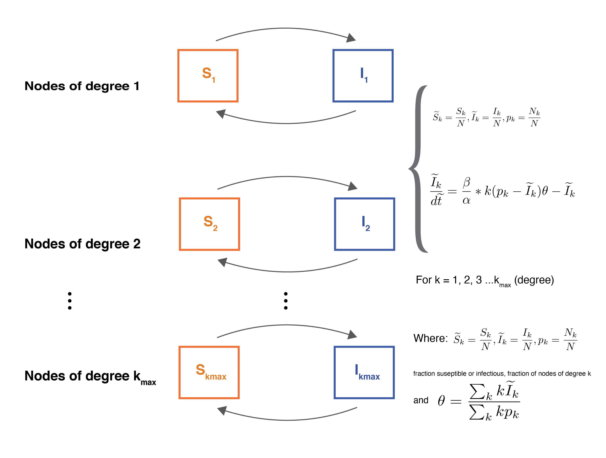
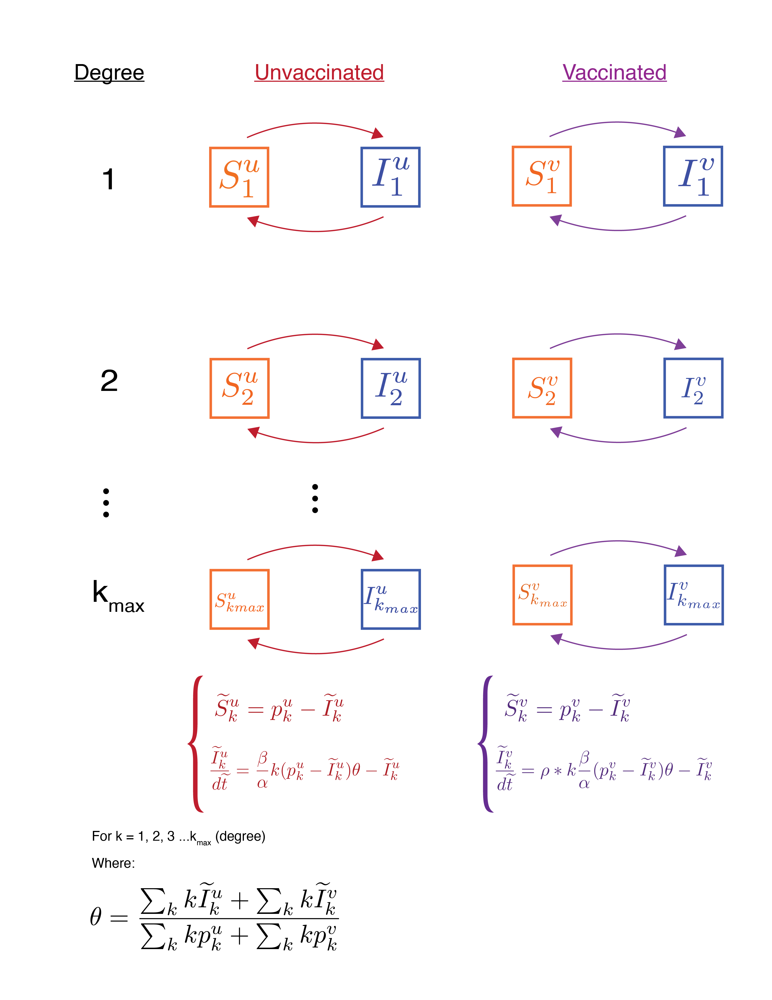
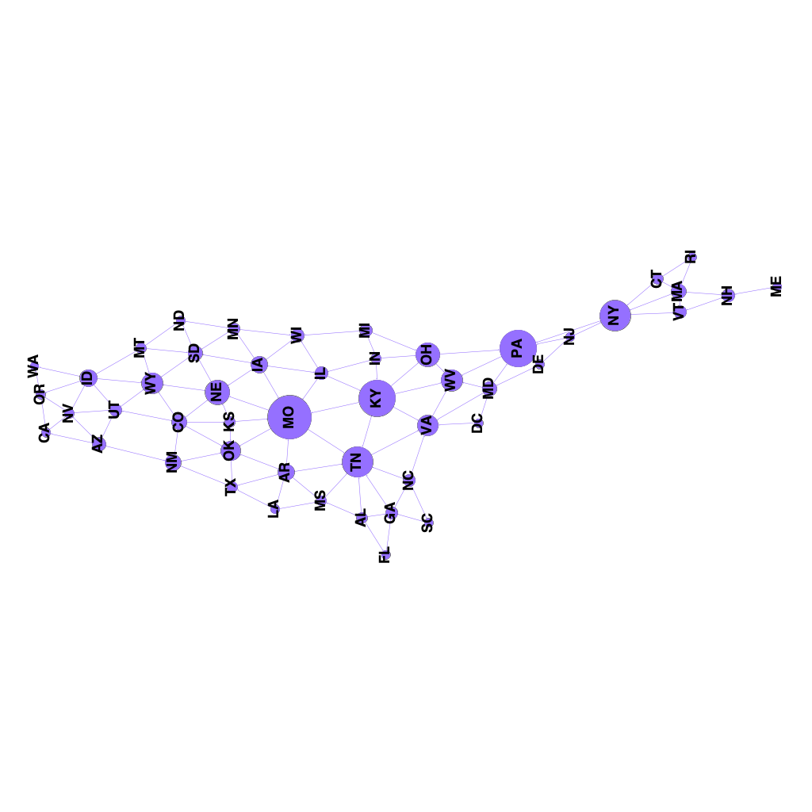
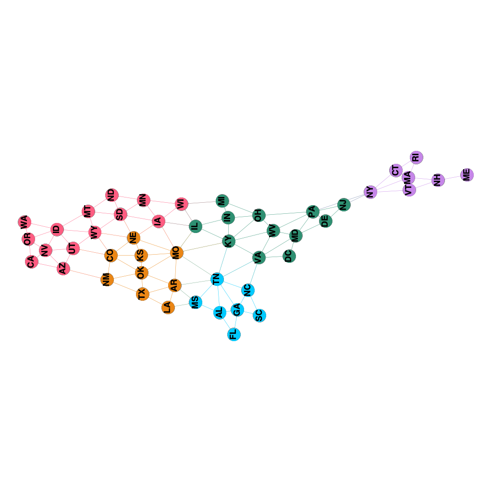

```{r setup, include = FALSE}
knitr::opts_chunk$set(echo = FALSE, message = FALSE)
require(tidyverse)

# Source
source("~/R/mocs/assignment_3/scripts/state_net.R")
```


# Question 1: The cascade model

## Part A
This network will always be acyclic because if we pick a random node, $i$, and step along one of its outward edges chosen at random to another node $i'$, and keep stepping along random outward edges from node to node, we can only step to nodes whose value of i is smaller, never larger. So wherever we start, we will always end up at a smaller value of $i$. We can never step from a node with a small value of $i$ back to a node with a larger value of $i$, so we can never return to our starting point to complete a loop.


## Part B
To calculate the average in-degree of vertex $i$ we can think about all the nodes that have an index $> i$, of which there are $N - i$. Each of these could be connected to node $i$ with a probability $p$, so the average in-degree of vertex $i$ is $(N-i)*p$. Conversely, to get the average out-degree of vertex $i$ we can think about the number of nodes with index $< i$, of which there are $(i-1)$, so the average out-degree of vertex $i$ is $(i-1)*p$.


## Part C
To calculate the expected number of edges that run from nodes $i' > i$ (‘big nodes’) to nodes $i' \leq i$ (‘small nodes’) we can begin by counting the number of big nodes and the number of small nodes. Then we can think about the expected number of connections between them if nodes in one group are connected to nodes in the other group with probability p. There are $N–i$ nodes with $i' > i$ (big nodes) and i nodes with $i' \leq i$ (small nodes). Any individual node among the $N–i$ big nodes could have up to i edges running to small nodes, one to each of them, and if each of these edges exists with probability p, we would expect any single big node to have $i*p$ edges to small nodes. If we sum these up over all the big nodes, we get a total of $(N–i)*i*p$ edges from big nodes to small nodes, or $(N*i–i^2)*p$ edges.

## Part D
Assuming N is even, what are the largest and smallest values of the quantity calculated in c) and where do they occur (in terms of $i$)? If we plotted $(N*i – i^2)*p$ over $i$, we would get a downward-facing parabola with roots at $i = 0$ and $i = N$. Since  $i$ can only have values from $1$ to $N$, it cannot equal zero, so the smallest value of the function is $0$ at $i = N$. The largest value of the function occurs at the top of the parabola, which is found halfway between the roots, at $i \frac{N}{2}$, where the function has a value of $\frac{N^2}{4}$.

\pagebreak

# Question 2

## Part A

Write a heterogeneous mean-field system or an SIS model on a configuration model network.




**Fig. 1**: Box and arrow diagram of the heterogeneous mean-field system without vaccination.


## Part B




**Fig. 2**: Box and arrow diagrams with equations for the heterogeneous mean-field system with vaccination.

<!-- ## Part C -->

See HeteroMeanFieldSIS.py lines 1-178 for code. We used nondimensionalized (fractional) $\tilde{S}$ and $\tilde{I}$ (and d $\tilde{t}$) throughout and chose a $k_{max}$ of 10. When modeling the random vaccination of 40% of the population, we assumed 40% of each degree class would be vaccinated. We modeled an initial infection prevalence of 50% of the population by assuming that 50% of each vaccinated and unvaccinated degree class (each compartment in the model) would be infected. We ran the model and plotted I-tilda over time for 500 time steps with a step size of 0.01 for 5 values of $\rho$ 0, 0.05, 0.25, 0.5, and 1 (Fig. 3). We chose these value to encompass a range of scenarios and responses: a nonexistent or useless vaccine ($\rho$ = 1), a 50% effective vaccine ($\rho$ = 0.5), a 75% or 95% effective vaccine ($\rho$ = 0.25 or 0.05), and a 100% effective vaccine ($\rho$ = 0).

Figure 3 shows that a lower value of $\rho$ (more effective vaccine) does reduce the equilibrium number of infections, but even a 100% effective vaccine ($\rho$ = 0) is not sufficient to eradicate the outbreak — the fraction of infected nodes stabilizes at a value that’s still over 10%. This kind of makes sense when you consider that vaccinating 40% of the population still leaves the disease free to spread and infect the other 60% of the population. While vaccinating that 40% can reduce the number of infected contacts each person has, it still leaves the disease free to run wild in a smaller subset of nodes and edges.


```{r, fig.width = 7, fig.height = 3}

p1 <- cowplot::ggdraw() + 
        cowplot::draw_image("~/R/mocs/assignment_3/data/RandomVaccRhos.png") 

p2 <- cowplot::ggdraw() + 
        cowplot::draw_image("~/R/mocs/assignment_3/data/PopVaccRhos.png") 


cowplot::plot_grid(p1, p2, nrow = 1, labels = "AUTO")

```


**Fig. 3**: Number of infections over time for a system with A) randomly vaccinated nodes and B) the highest degree nodes vaccinated.

## Part D

See HeteroMeanFieldSIS.py lines 181-225 for code. Examining the cumulative degree distribution of nodes in each degree class, we found that the lower 60% of nodes were of degree 0 - 3, and the upper 40% of nodes were of degree 3 - 10. Therefore when modeling the vaccination of the 40% of nodes with highest degree, we assumed 0% of the lower degree classes (k = 0, 1, and 2) would be vaccinated, 100% of the higher degree classes (k = 4 - 10) would be vaccinated, and nodes of degree 3 would be split in such a way that 60% of the population remained unvaccinated. We then applied an initial infection prevalence of 50% and ran and plotted the model for the 5 values of $\rho$  as in the previous question (Figure 3B)

A comparison of Figure 3A and Figure 3B shows that vaccinating the highest degree nodes is much more effective than vaccinating a random subset of the population. We see the same basic trend in Figure 3B as in Figure 3A where lower values of $\rho$ reduce the equilibrium fraction of infected nodes, however in Figure 3B, each subsequent smaller $\rho$ reduces the equilibrium infected fraction to a lower value than in Figure 3A. Even for a 100% effective vaccine ($\rho$ = 0), we do not completely eradicate the outbreak, but we do get a much lower equilibrium value than for random vaccination, closer to 5% instead of 15%. Figure 4 makes this difference even clearer. Whether the outbreak is truly eradicated will ultimately depend on the population size. If we were dealing with a population of 10 people, it would probably become eradicated, while in a population of thousands, it would probably remain present at a low level. Since we are using a fractional $\tilde{I}$, the value may never reach 0, but only a very small fraction.


```{r, fig.width = 7, fig.height = 3}

cowplot::ggdraw() + 
  cowplot::draw_image("~/R/mocs/assignment_3/data/SIBothVaccs.png") 


```

**Fig. 4**: Number of infectious and susceptible individuals over time for $\rho$ = 0.1 for both random vaccinations and vaccination based on the highest degree.


\pagebreak

# Question 3

Pick a network of your choice on the Colorado Index of Complex Networks. Play around with network visualizations, share one of them in your write-up and note of what information if any you can glean from visualizing the network. Describe the network: What are the nodes? What are the edges? What is the average degree? What are some other static network measures, and why are they significant to this system? Tip: Avoid taking a network larger than a thousand nodes to help you with the visualization and the next problem.


Our network represents the 48 contiguous United States and the District of Columbia (for 49 nodes total). Since question 4 revolved around analyzing the voter model and the capacity of a network to reach consensus (i.e. reach the same state for all nodes), we thought it would be pertinent to choose a network directly related to this, and therefore chose a basic U.S. map. The appearance of the network itself loosely matches the geographic orientation of states and subregions within the U.S. and a viewer may decipher patterns corresponding to known locations of states in such a network structure, although there are obvious departures as the network needs not necessarily exactly correspond (eg. in terms of scale or distance). Clearly the nodes in this network are representative of US states, as labeled, with the edges representing the geographic borders shared between states. Maine is the only U.S. state connected by a single edge, sharing a land border only with New Hampshire (the beautiful seacoast of NH prevents it from coming into contact with Massachusetts). Other states are far more connected, particularly Missouri and Tennessee which have 8 edges apiece. The average degree (or average number of edges for a given node) is 4.28, a logical output as most states share about 4 borders with other states. 

In Fig. 5 we have displayed the nodes according to betweenness-centrality, where it is obvious that Missouri is the most central state within the network, that is,  it most often acts as a connection between shortest path lengths amongst other nodes. New York also serves as an apparently important central state, acting as a bottleneck cutting off New England from the rest of the country. States that have high betweenness centrality likely have larger influence on network dynamics, possibly including how and if states will reach a consensus within the voter model. 

The network is moderately clustered, with a clustering coefficient of 0.507. Assessing the modularity of the network reveals 5 distinct communities (Fig. 6) with an associated value of 0.579. These more densely connected communities may influence each other more than those outside of these communities, for example we can see that one cluster corresponds to NY and New England, and these states tend to vote together (both in real life and in our model).


{width=70%}


**Fig. 5**: Contiguous U.S. states network with size of nodes determined by betweenness-centrality measure. YifanHu layout is used for this visualization. 

{width=70%}


**Fig. 6**: Contiguous U.S. states network with nodes colored by modularity class with a resolution of 1.0. 5 distinct communities are apparent within the network. Yifan Hu layout was used for this visualization. 


\pagebreak

# Question 4

## Part A

Using the network you chose in the previous problem, implement the voter model
and run it on your network using some initial conditions (i.e. 50% red and 50%
blue randomly distributed). Averaged over a few runs, does the network tend
reach consensus? If so, how fast? Try a few different initial conditions.

### Intial Conditions

```{r, fig.height = 6, fig.width = 3}
# # Plot the initial networks
# net <- graph_from_data_frame(d = edges,
#                              vertices = nodes, 
#                              directed = FALSE)

# # Size the network proportional to population or degree
# V(net)$size <- state_pop$population/1000000
# V(net)$size <- node_degree*3

# Plot the initial networks

# # 2016 map
# set.seed(12)
# V(net)$color <- V(net)$party_2016
# p1 <- plot(net, layout = layout_with_graphopt)
# 
# # By degree
# V(net)$color <- V(net)$party_deg
# p2 <- plot(net, layout = layout_with_graphopt)
# 
# # Random
# V(net)$color <- V(net)$party_rand
# p3 <- plot(net, layout = layout_with_graphopt)

# p1 <- cowplot::ggdraw() + 
#   cowplot::draw_image("~/R/mocs/assignment_3/data/2016_map.png") +
#   cowplot::draw_label("2016 Presidential Map", x = 0.25, y = 0.5)
# p2 <- cowplot::ggdraw() + 
#   cowplot::draw_image("~/R/mocs/assignment_3/data/deg_map.png") +
#   cowplot::draw_label("Degree-based Map", x = 0.35, y = 0.65)
# p3 <- cowplot::ggdraw() + 
#   cowplot::draw_image("~/R/mocs/assignment_3/data/rand_map.png") +
#   cowplot::draw_label("Random Map", x = 0.4, y = 0.75)
# 
# 
# # Plot all together
# cowplot::plot_grid(p1, p2, p3, nrow = 3)

cowplot::ggdraw() + 
   cowplot::draw_image("~/R/mocs/assignment_3/data/all_maps.png")
```


**Fig. 7:** Graphical representation of the intial conditions for the networks for each of the initial conditions that we tested, 2016 Presidential Map (top), Degree-based map (middle), and a Random Map (bottom).


We ran the voter model on three different initial conditions of the US States Network (Fig. 7). One was based on the 2016 Presdential Election Results, one was that we set all nodes above 4 degrees to blue and all nodes at or below 4 degrees to red, and the last was a random assignment of red and blue states. 

We ran the stochastic model a total of 20 times on each initial condition for a total of 10,000 time steps. The states reached a consensus the vast majority of the time, with the random map reaching consensus 90% of the time, the 2016 presidential map reaching consensus 95% of the time, and the map based on degree reached consensus for all 20 replicates. Of the trials that reached consensus, the time that it took to reach consensus varied (Fig. 8). 

# Voter Model Runs

```{r, fig.height = 3, fig.width = 7}
time_df_tidy <- time_df %>%
  pivot_longer(-time, names_to = "lab", values_to = "blue") %>%
  separate(lab, into = c("init_cond", "Trial"), sep = ":") 

time_consensus <- time_df_tidy %>%
  group_by(init_cond, Trial) %>%
  filter(blue == 49 | blue == 0) %>%
  slice_min(time, n = 1) %>%
  group_by(init_cond) %>%
  summarize(time_consensus_avg = mean(time),
            time_consensus_sd = sd(time))

prop_consensus <- time_df_tidy %>%
  group_by(init_cond, Trial) %>%
  filter(blue == 49 | blue == 0) %>%
  slice_min(time, n = 1) %>%
  group_by(init_cond) %>%
  count() %>%
  mutate(prop = n/20)


# Bloxplot of the time to reach consensus
time_df_tidy %>%
  group_by(init_cond, Trial) %>%
  filter(blue == 49 | blue == 0) %>%
  slice_min(time, n = 1) %>%
  ggplot() +
  geom_boxplot(aes(x = time, fill = init_cond)) + 
  scale_fill_manual(name = "Initial Map",
                    values = c("green", "purple", "yellow"),
                    labels = c("2016 Presidential Map", 
                               "Based on degree",
                               "Assigned randomly")) +
  coord_flip() +
  xlab("Time to reach consensus") +
  theme_classic() +
  theme(axis.ticks.x = element_blank(),
        axis.text.x = element_blank()) 
```


**Fig. 8**: Boxplot of the time to reach consensus for each of the initial map conditions. 


```{r, fig.height = 3, fig.width = 7}
# Tidy the data.frame and average over each trial
time_df_avg <- time_df_tidy %>%
  mutate(red = 49 - blue) %>%
  group_by(time, init_cond) %>%
  summarize(blue = mean(blue), 
            red = mean(red))

# Plot the party's over time
  ggplot(time_df_avg) +
  geom_line(aes(x = time, y = blue, linetype = init_cond), color = "blue") + 
  geom_line(aes(x = time, y = red, linetype = init_cond), color = "red") +
  labs(title = "Voter model over time", y = "Number of states", x = "Time") +
  scale_linetype_manual(name = "Initial Map",
                        values = c(1, 2, 3),
                        labels = c("2016 Presidential Map", 
                                   "Based on degree",
                                   "Assigned randomly")) + 
  ylim(c(0, 50)) +
  theme_classic()
```


**Fig. 9**: Line graph of the average number of blue and red states over the 20 trials for the each of the different initial conditions.

## Part B

Now, find the degree distribution of your network and run (or imagine) the voter
model using a resulting configuration model network. How do you expect the
dynamics to compare to the real network? Explain with simulation results or in
words.


```{r, fig.height = 3, fig.width = 5}
# Plot the degree distribution of the network
ggplot() + 
  geom_histogram(data = nodes, aes(x = degree), 
                 bins = 8, 
                 color = "grey50", 
                 fill = "grey30") +
  ylim(c(0, 13)) +
  labs(title = "Degree Distribition of the United States Network", 
       y = "Number of States",
       x = "Degree") +
  theme_classic()
```

**Fig. 10**: Degree distribution of the United States Map Network. 


The network of US states only has one node of degree 1, so we cannot end up with lots of islands with nodes of degree 1 pairing up (Fig. 10). We could potentially get some isolated triangles or other shapes if some nodes of degree 2 circle up with each other. Then they would be cut off from the rest of the network and might reach a different consensus from the other nodes, since they would share no edges. But even this is unlikely since the network has only 5 nodes of degree 2 (Fig. 10). Nodes of higher degree are less likely to form disjointed groups, since the more edges each node has, the more likely it is to have at least one edge connecting to the giant component.

One interesting structural feature of this network is that NY acts as a bottleneck restricting change in New England, since it is the only node connecting New England to the rest of the United States. If New England starts out blue, it tends to stay blue, since the only way for it to change would be for NY to change and then spread the change to the rest of New England. In a randomized configuration model, we could end up with a network where the New England states are better connected to the rest of the network instead of being isolated in a sort of peninsula. In that case we might expect these states to change party more often.

